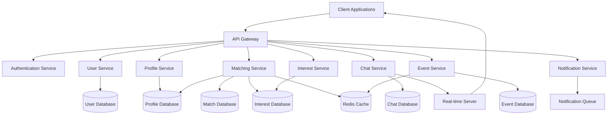

# Design Document: Matcha Social Platform

## Overview

The Matcha social platform is designed to connect users based on shared interests, preferences, and compatibility. This document outlines the technical design and architecture for implementing the Matcha platform, focusing on the five core features: User Profile Management, Matching System, Chat System, Interest Ranking System, and Event-Based Meeting Feature.

The platform will be built using a modern, scalable architecture that supports real-time communication, efficient matching algorithms, and a responsive user interface. The design prioritizes user privacy, system performance, and extensibility to accommodate future enhancements.

## Architecture

### High-Level Architecture

The Matcha platform will follow a microservices architecture to ensure scalability, maintainability, and independent deployment of services. The system will be composed of the following major components:

1. **Frontend Application**
   - Web application (responsive design)
   - Mobile applications (iOS and Android)

2. **Backend Services**
   - User Service
   - Profile Service
   - Matching Service
   - Chat Service
   - Interest Service
   - Event Service
   - Notification Service

3. **Data Storage**
   - User Database (PostgreSQL)
   - Profile Database (PostgreSQL)
   - Chat Database (MongoDB)
   - Event Database (PostgreSQL)
   - Media Storage (AWS S3 or equivalent)

4. **Infrastructure Components**
   - API Gateway
   - Authentication Service
   - Real-time Communication Server (WebSockets)
   - Caching Layer (Redis)
   - Search Engine (Elasticsearch)
   - Background Job Processor

### System Architecture Diagram



## Components and Interfaces

### 1. User Service

**Responsibilities:**
- User registration and authentication
- User account management
- Security and access control

**Key Interfaces:**
```typescript
interface UserService {
  registerUser(userData: UserRegistrationData): Promise<User>;
  authenticateUser(credentials: UserCredentials): Promise<AuthToken>;
  getUserById(userId: string): Promise<User>;
  updateUserAccount(userId: string, userData: Partial<UserData>): Promise<User>;
  deactivateAccount(userId: string): Promise<boolean>;
}
```

### 2. Profile Service

**Responsibilities:**
- Profile creation and management
- Profile picture handling
- Privacy settings management

**Key Interfaces:**
```typescript
interface ProfileService {
  createProfile(userId: string, profileData: ProfileData): Promise<Profile>;
  getProfile(profileId: string, viewerId?: string): Promise<Profile>;
  updateProfile(profileId: string, profileData: Partial<ProfileData>): Promise<Profile>;
  uploadProfilePicture(profileId: string, imageData: Buffer): Promise<string>;
  updatePrivacySettings(profileId: string, settings: PrivacySettings): Promise<PrivacySettings>;
}
```

### 3. Matching Service

**Responsibilities:**
- Implementing matching algorithms
- Processing user preferences
- Generating and managing match recommendations
- Handling compatibility questions

**Key Interfaces:**
```typescript
interface MatchingService {
  generateMatches(userId: string, count?: number): Promise<Match[]>;
  filterMatchesByAge(userId: string, minAge: number, maxAge: number): Promise<Match[]>;
  getCompatibilityQuestions(matchId: string): Promise<Question[]>;
  submitQuestionAnswers(matchId: string, userId: string, answers: Answer[]): Promise<MatchStatus>;
  acceptMatch(matchId: string, userId: string): Promise<MatchStatus>;
  rejectMatch(matchId: string, userId: string): Promise<void>;
}
```

### 4. Chat Service

**Responsibilities:**
- Managing private and group conversations
- Message delivery and storage
- Chat history and search
- Integration with external SNS platforms

**Key Interfaces:**
```typescript
interface ChatService {
  createPrivateChat(userIds: string[]): Promise<ChatRoom>;
  createGroupChat(name: string, creatorId: string, participantIds: string[]): Promise<ChatRoom>;
  sendMessage(chatId: string, senderId: string, content: MessageContent): Promise<Message>;
  getChatHistory(chatId: string, limit?: number, before?: Date): Promise<Message[]>;
  addParticipantToChat(chatId: string, userId: string): Promise<boolean>;
  removeParticipantFromChat(chatId: string, userId: string): Promise<boolean>;
  blockUser(blockerId: string, blockedId: string): Promise<boolean>;
  connectExternalSNS(userId: string, provider: SNSProvider, credentials: SNSCredentials): Promise<boolean>;
}
```

### 5. Interest Service

**Responsibilities:**
- Managing interest categories
- Handling user interest selections and rankings
- Calculating interest-based compatibility scores

**Key Interfaces:**
```typescript
interface InterestService {
  getInterestCategories(): Promise<Category[]>;
  getUserInterests(userId: string): Promise<RankedInterest[]>;
  addUserInterest(userId: string, interest: Interest, rank: number): Promise<RankedInterest>;
  updateInterestRanking(userId: string, interestId: string, newRank: number): Promise<RankedInterest>;
  removeUserInterest(userId: string, interestId: string): Promise<boolean>;
  addCustomInterest(userId: string, interestData: NewInterestData, rank: number): Promise<RankedInterest>;
  calculateCompatibilityScore(userIdA: string, userIdB: string): Promise<number>;
}
```

### 6. Event Service

**Responsibilities:**
- Event creation and management
- Event discovery and recommendations
- Participant management
- Event reminders and notifications

**Key Interfaces:**
```typescript
interface EventService {
  createEvent(creatorId: string, eventData: EventData): Promise<Event>;
  getEvents(filters?: EventFilters): Promise<Event[]>;
  getEventById(eventId: string): Promise<Event>;
  joinEvent(eventId: string, userId: string): Promise<boolean>;
  leaveEvent(eventId: string, userId: string): Promise<boolean>;
  getEventParticipants(eventId: string): Promise<User[]>;
  updateEvent(eventId: string, eventData: Partial<EventData>): Promise<Event>;
  cancelEvent(eventId: string): Promise<boolean>;
  shareEventToSNS(eventId: string, userId: string, platform: SNSPlatform): Promise<string>;
}
```

### 7. Notification Service

**Responsibilities:**
- Sending in-app notifications
- Push notifications for mobile devices
- Email notifications
- Notification preferences management

**Key Interfaces:**
```typescript
interface NotificationService {
  sendNotification(userId: string, notification: Notification): Promise<boolean>;
  sendPushNotification(userId: string, notification: PushNotification): Promise<boolean>;
  sendEmailNotification(userId: string, emailData: EmailData): Promise<boolean>;
  getUserNotifications(userId: string, limit?: number, offset?: number): Promise<Notification[]>;
  markNotificationAsRead(notificationId: string): Promise<boolean>;
  updateNotificationPreferences(userId: string, preferences: NotificationPreferences): Promise<NotificationPreferences>;
}
```

## Data Models

### User Model

```typescript
interface User {
  id: string;
  email: string;
  passwordHash: string;
  phoneNumber?: string;
  createdAt: Date;
  lastActive: Date;
  status: UserStatus;
  accountSettings: AccountSettings;
}

enum UserStatus {
  ACTIVE = 'active',
  INACTIVE = 'inactive',
  SUSPENDED = 'suspended',
  DELETED = 'deleted'
}

interface AccountSettings {
  emailVerified: boolean;
  phoneVerified: boolean;
  twoFactorEnabled: boolean;
  notificationPreferences: NotificationPreferences;
}
```

### Profile Model

```typescript
interface Profile {
  id: string;
  userId: string;
  displayName: string;
  age: number;
  location: Location;
  biography: string;
  profilePictures: ProfilePicture[];
  privacySettings: PrivacySettings;
  createdAt: Date;
  updatedAt: Date;
}

interface Location {
  city: string;
  state?: string;
  country: string;
  coordinates?: {
    latitude: number;
    longitude: number;
  };
}

interface ProfilePicture {
  id: string;
  url: string;
  isPrimary: boolean;
  uploadedAt: Date;
}

interface PrivacySettings {
  profileVisibility: VisibilityLevel;
  ageVisibility: VisibilityLevel;
  locationVisibility: VisibilityLevel;
  interestsVisibility: VisibilityLevel;
  onlineStatusVisibility: VisibilityLevel;
}

enum VisibilityLevel {
  PUBLIC = 'public',
  MATCHES_ONLY = 'matches_only',
  PRIVATE = 'private'
}
```

### Match Model

```typescript
interface Match {
  id: string;
  userIds: [string, string];
  status: MatchStatus;
  compatibilityScore: number;
  createdAt: Date;
  updatedAt: Date;
  questionnaireCompleted: boolean;
  lastInteractionDate?: Date;
}

enum MatchStatus {
  PENDING = 'pending',
  CONFIRMED = 'confirmed',
  REJECTED = 'rejected',
  EXPIRED = 'expired'
}

interface Question {
  id: string;
  text: string;
  options?: string[];
  type: QuestionType;
}

enum QuestionType {
  MULTIPLE_CHOICE = 'multiple_choice',
  TEXT = 'text',
  BOOLEAN = 'boolean'
}

interface Answer {
  questionId: string;
  value: string | boolean | number;
}
```

### Interest Model

```typescript
interface Category {
  id: string;
  name: string;
  description: string;
  iconUrl: string;
}

interface Interest {
  id: string;
  categoryId: string;
  name: string;
  isCustom: boolean;
  createdBy?: string;
}

interface RankedInterest {
  userId: string;
  interestId: string;
  interest: Interest;
  rank: number;
  addedAt: Date;
}
```

### Chat Model

```typescript
interface ChatRoom {
  id: string;
  type: ChatType;
  name?: string;
  participantIds: string[];
  createdAt: Date;
  updatedAt: Date;
  lastMessageAt?: Date;
  eventId?: string;
}

enum ChatType {
  PRIVATE = 'private',
  GROUP = 'group',
  EVENT = 'event'
}

interface Message {
  id: string;
  chatId: string;
  senderId: string;
  content: MessageContent;
  sentAt: Date;
  readBy: {
    userId: string;
    readAt: Date;
  }[];
}

interface MessageContent {
  type: MessageType;
  text?: string;
  mediaUrl?: string;
  location?: Location;
  eventId?: string;
}

enum MessageType {
  TEXT = 'text',
  IMAGE = 'image',
  VIDEO = 'video',
  AUDIO = 'audio',
  LOCATION = 'location',
  EVENT_SHARE = 'event_share'
}
```

### Event Model

```typescript
interface Event {
  id: string;
  creatorId: string;
  title: string;
  description: string;
  eventType: EventType;
  location: Location;
  startDate: Date;
  endDate: Date;
  maxParticipants?: number;
  participantIds: string[];
  status: EventStatus;
  chatId?: string;
  createdAt: Date;
  updatedAt: Date;
}

enum EventType {
  TRAVEL = 'travel',
  DRINKING = 'drinking',
  CONCERT = 'concert',
  DINING = 'dining',
  SPORTS = 'sports',
  OTHER = 'other'
}

enum EventStatus {
  UPCOMING = 'upcoming',
  ONGOING = 'ongoing',
  COMPLETED = 'completed',
  CANCELLED = 'cancelled'
}
```

### Notification Model

```typescript
interface Notification {
  id: string;
  userId: string;
  type: NotificationType;
  title: string;
  message: string;
  data?: Record<string, any>;
  isRead: boolean;
  createdAt: Date;
}

enum NotificationType {
  NEW_MATCH = 'new_match',
  NEW_MESSAGE = 'new_message',
  MATCH_CONFIRMED = 'match_confirmed',
  EVENT_REMINDER = 'event_reminder',
  EVENT_INVITATION = 'event_invitation',
  PROFILE_VIEW = 'profile_view'
}

interface NotificationPreferences {
  newMatches: boolean;
  messages: boolean;
  eventReminders: boolean;
  eventInvitations: boolean;
  profileViews: boolean;
  emailNotifications: boolean;
  pushNotifications: boolean;
}
```

## Error Handling

### Error Types

The system will implement a standardized error handling approach with the following error categories:

1. **Validation Errors**: Errors related to invalid input data
2. **Authentication Errors**: Errors related to user authentication
3. **Authorization Errors**: Errors related to insufficient permissions
4. **Resource Errors**: Errors related to resource availability
5. **System Errors**: Internal server errors
6. **External Service Errors**: Errors from third-party services

### Error Response Format

All API endpoints will return errors in a consistent format:

```typescript
interface ErrorResponse {
  status: number;
  code: string;
  message: string;
  details?: Record<string, any>;
  timestamp: string;
  requestId: string;
}
```

### Error Handling Strategy

1. **Client-Side Error Handling**:
   - Implement global error interceptors in frontend applications
   - Display user-friendly error messages
   - Implement retry mechanisms for transient errors
   - Log errors for debugging purposes

2. **Server-Side Error Handling**:
   - Implement middleware for catching and formatting errors
   - Log detailed error information for debugging
   - Implement circuit breakers for external service calls
   - Use correlation IDs to track requests across services

## Testing Strategy

### Testing Levels

1. **Unit Testing**:
   - Test individual components and services in isolation
   - Mock external dependencies
   - Achieve high code coverage (target: >80%)

2. **Integration Testing**:
   - Test interactions between services
   - Test database operations
   - Verify API contracts

3. **End-to-End Testing**:
   - Test complete user flows
   - Simulate real user interactions
   - Test across different devices and browsers

4. **Performance Testing**:
   - Load testing for high-traffic scenarios
   - Stress testing for system limits
   - Latency testing for real-time features

### Testing Tools and Frameworks

1. **Unit Testing**:
   - Jest for JavaScript/TypeScript
   - JUnit for Java components

2. **Integration Testing**:
   - Supertest for API testing
   - Testcontainers for database testing

3. **End-to-End Testing**:
   - Cypress for web applications
   - Detox for mobile applications

4. **Performance Testing**:
   - JMeter for load testing
   - Gatling for stress testing

### Test Automation

1. **CI/CD Integration**:
   - Run tests on every pull request
   - Block merges if tests fail
   - Generate test coverage reports

2. **Test Data Management**:
   - Use fixtures for consistent test data
   - Implement database seeding for integration tests
   - Reset test environment between test runs

## Security Considerations

1. **Authentication and Authorization**:
   - Implement OAuth 2.0 / OpenID Connect for authentication
   - Use JWT for session management
   - Implement role-based access control
   - Support multi-factor authentication

2. **Data Protection**:
   - Encrypt sensitive data at rest and in transit
   - Implement proper password hashing (bcrypt)
   - Anonymize data for analytics purposes
   - Implement data retention policies

3. **API Security**:
   - Rate limiting to prevent abuse
   - Input validation for all endpoints
   - Protection against common attacks (CSRF, XSS, SQL Injection)
   - API key management for external integrations

4. **Privacy**:
   - Compliance with privacy regulations (GDPR, CCPA)
   - User consent management
   - Data export and deletion capabilities
   - Privacy by design principles

## Scalability and Performance

1. **Horizontal Scaling**:
   - Stateless services for easy replication
   - Load balancing across service instances
   - Database sharding for large datasets

2. **Caching Strategy**:
   - Redis for frequently accessed data
   - CDN for static assets
   - Client-side caching where appropriate

3. **Database Optimization**:
   - Proper indexing for common queries
   - Read replicas for read-heavy operations
   - Connection pooling for efficient resource usage

4. **Real-time Performance**:
   - WebSocket connection pooling
   - Message queuing for asynchronous processing
   - Optimized payload sizes for mobile clients

## Deployment and DevOps

1. **Containerization**:
   - Docker for service packaging
   - Kubernetes for orchestration
   - Helm charts for deployment configuration

2. **CI/CD Pipeline**:
   - Automated builds and testing
   - Blue-green deployments
   - Canary releases for risk mitigation

3. **Monitoring and Observability**:
   - Prometheus for metrics collection
   - Grafana for visualization
   - ELK stack for log aggregation
   - Distributed tracing with Jaeger

4. **Infrastructure as Code**:
   - Terraform for infrastructure provisioning
   - Ansible for configuration management
   - GitOps workflow for infrastructure changes

## Future Considerations

1. **Internationalization and Localization**:
   - Support for multiple languages
   - Region-specific features and content
   - Cultural preferences in matching algorithms

2. **Accessibility**:
   - WCAG 2.1 compliance
   - Screen reader compatibility
   - Keyboard navigation support

3. **AI and Machine Learning**:
   - Enhanced matching algorithms
   - Content moderation
   - User behavior analysis for improved recommendations

4. **Offline Support**:
   - Progressive Web App capabilities
   - Offline message composition
   - Data synchronization when connectivity is rest